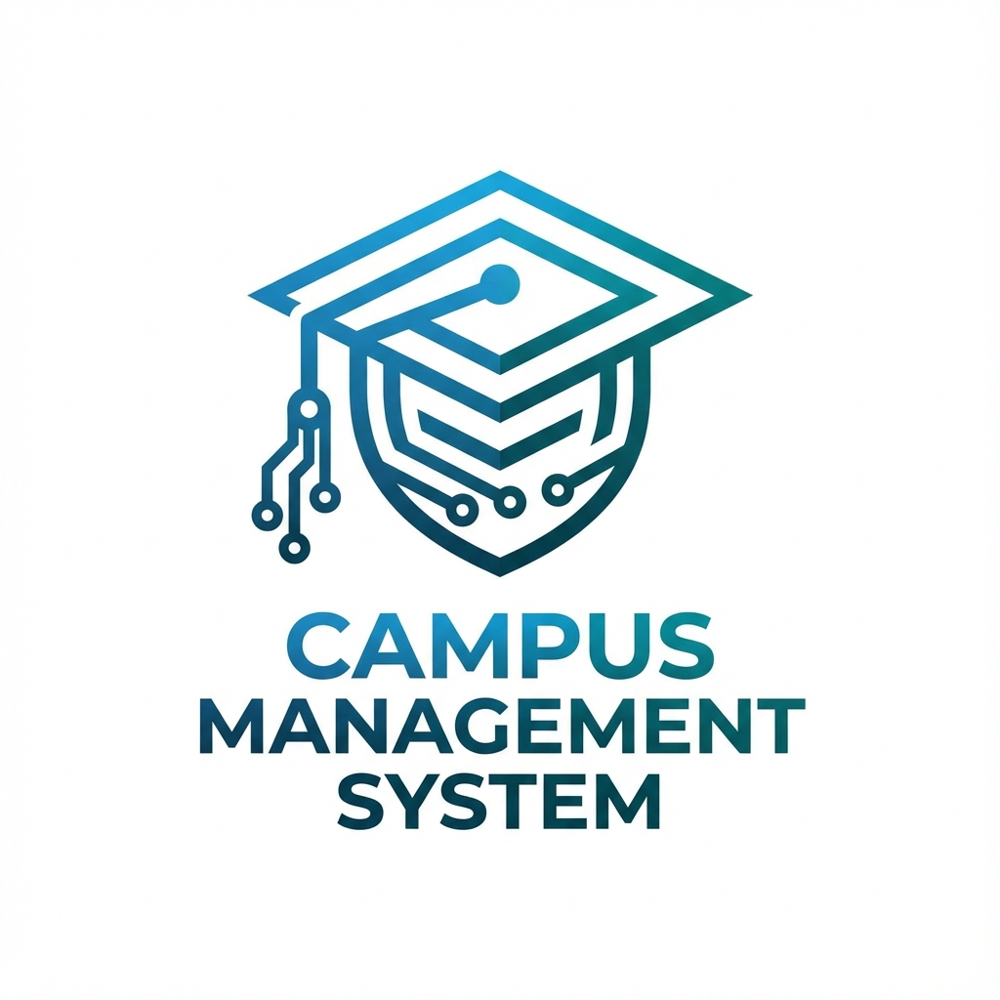
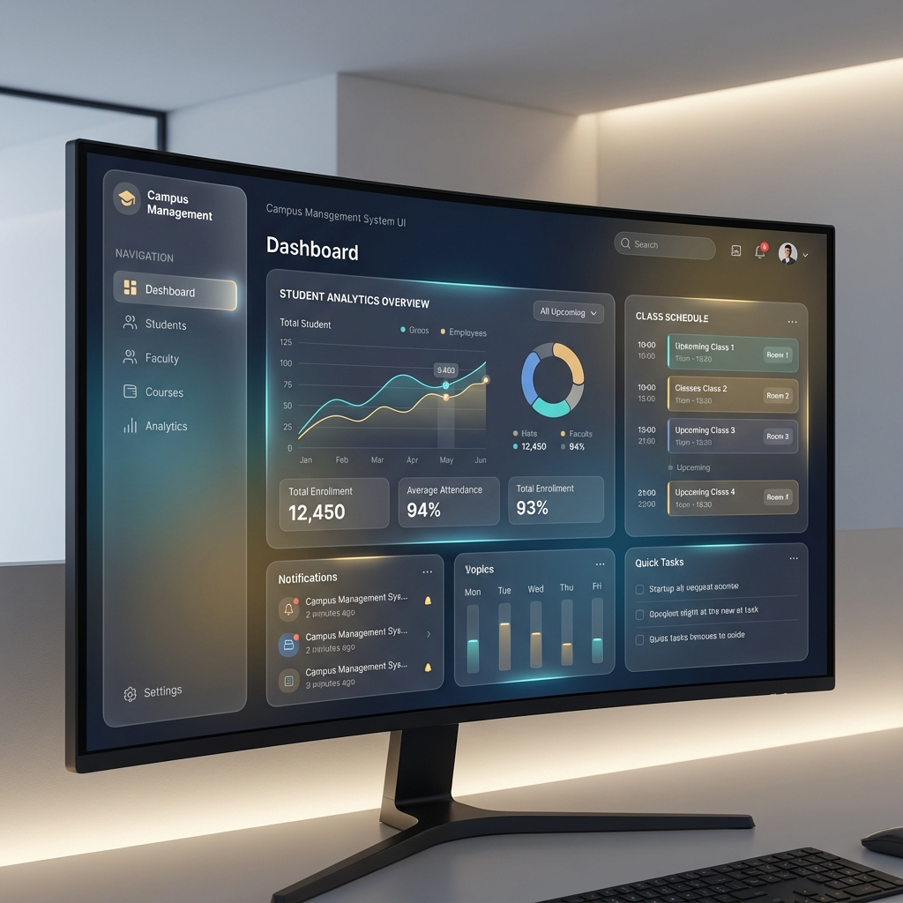

<div align="center">
  
  <h1>🎓 Campus Management System (CMS)</h1>
  <p><b>A next-generation, feature-rich platform to empower modern educational institutions.</b></p>

  <p>
    
    
    
    
    
  </p>
</div>

---



## 🌟 Overview

The **Campus Management System (CMS)** is a comprehensive, modern, and high-performance solution designed to streamline academic operations, enhance collaboration, and provide a seamless digital experience for students, staff, and administrators. Built with a focus on usability, scalability, and intelligence, CMS leverages cutting-edge technologies to bring efficiency to every corner of the campus.

---

## 🚀 Key Features

### 🏢 Administrator Powerhouse

- **Entity Management**: Ultimate control over Departments, Courses, and Subjects.
- **User Governance**: Centralized lifecycle management for Staff and Student accounts.
- **Academic Orchestration**: Seamlessly configure academic years, semesters, and institutional events.
- **Intelligent Analytics**: Data-driven insights into attendance trends, department performance, and success rates.
- **Global Broadcast**: Instant communication via system-wide notices and push notifications.

### 🍎 Staff Excellence Hub

- **Lighthouse Dashboard**: Clear overview of personal workload, assigned subjects, and automated timetables.
- **Precision Attendance**: Session-based attendance tracking with smart locking and historical reporting.
- **Dynamic Evaluations**: End-to-end management of internal/external marks and digital assignments.
- **Performance Tracking**: Subject-specific analytics to identify and support student progress.

### 🎓 Student Success Portal

- **Unified Dashboard**: Real-time view of attendance standing, class schedules, and latest campus updates.
- **Academic Records**: On-demand access to exam results, internal marks, and comprehensive progress charts.
- **Integrated Learning**: Stay ahead with online assignment submissions and resource access.
- **Personal Profile**: Manage academic history and personal details in one secure location.

### 🤖 Intelligent & Social

- **AI-Powered Assistance**: Integrated **Google Gemini AI** for smart content generation and academic support.
- **Unified Communication**: Segmented notice boards and real-time **Firebase Cloud Messaging (FCM)** notifications.

---

## 🛠️ Technology Stack

| Domain       | Technology                                                                                                                  |
| :----------- | :-------------------------------------------------------------------------------------------------------------------------- |
| **Frontend** | [Next.js 15](https://nextjs.org/), [React 19](https://react.dev/), [Tailwind CSS 4](https://tailwindcss.com/)               |
| **Backend**  | [NestJS 11](https://nestjs.com/), [Node.js](https://nodejs.org/)                                                            |
| **Database** | [PostgreSQL](https://www.postgresql.org/), [Prisma ORM](https://www.prisma.io/)                                             |
| **UI/UX**    | [Framer Motion](https://www.framer.com/motion/), [Radix UI](https://www.radix-ui.com/), [Lucide Icons](https://lucide.dev/) |
| **Charts**   | [Recharts](https://recharts.org/)                                                                                           |
| **Auth**     | [Iron Session](https://github.com/vvo/iron-session), [Passport.js](https://www.passportjs.org/), Firebase Auth              |
| **Services** | Firebase (FCM), [Gemini AI](https://ai.google.dev/), [Nodemailer](https://nodemailer.com/)                                  |

---

## 📁 Project Architecture

CMS uses a clean, monorepo-inspired structure to maintain separation of concerns:

- **`/client`**: The Next.js frontend application (App Router, Server Actions).
- **`/server`**: The NestJS backend API (Modular architecture, Prisma integration).
- **`/cdn`**: Specialized service for high-speed asset delivery.
- **`/assets`**: Project branding and documentation visuals.

---

## ⚙️ Getting Started

### 📋 Prerequisites

- **Node.js**: v20 or higher
- **PostgreSQL**: Stable version
- **Firebase**: Project setup for Authentication and FCM
- **Gemini API**: API key for AI features

### 🛠️ Installation & Setup

1. **Clone the repository**

   ```bash
   git clone https://github.com/Piyush3155/Campus-Management-System.git
   cd Campus-Management-System
   ```

2. **Backend Configuration**

   ```bash
   cd server
   npm install
   # Copy .env.example to .env and configure your variables
   cp .env.example .env
   npx prisma generate
   npx prisma migrate dev
   npm run start:dev
   ```

3. **Frontend Configuration**

   ```bash
   cd ../client
   npm install
   # Copy .env.example to .env and configure your variables
   cp .env.example .env
   npm run dev
   ```

4. **CDN Setup** (Optional)
   ```bash
   cd ../cdn
   npm install
   npm run start:dev
   ```

---

## 📖 API Documentation

The backend is equipped with **Swagger UI**, providing a comprehensive and interactive API documentation playground. Once the server is running, access it at:
`http://localhost:4000/api/docs` (or your configured port/path).

---

## 🤝 Contributing

Contributions are what make the open-source community such an amazing place to learn, inspire, and create. Any contributions you make are **greatly appreciated**.

1. Fork the Project
2. Create your Feature Branch (`git checkout -b feature/AmazingFeature`)
3. Commit your Changes (`git commit -m 'Add some AmazingFeature'`)
4. Push to the Branch (`git push origin feature/AmazingFeature`)
5. Open a Pull Request

---

## 📄 License

Distributed under the **MIT License**. See `LICENSE` for more information.

---

<div align="center">
  Developed with 💙 by <a href="https://github.com/Piyush3155">Piyush</a>
</div>
